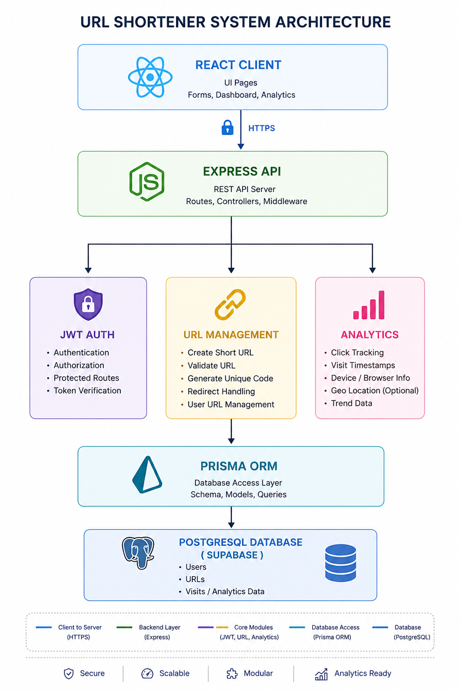
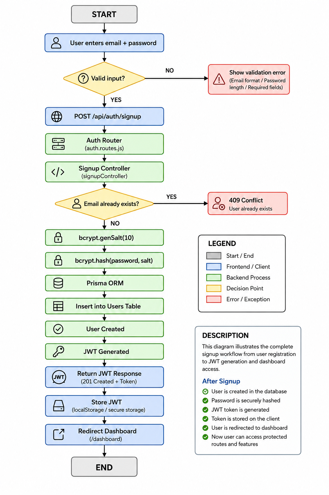
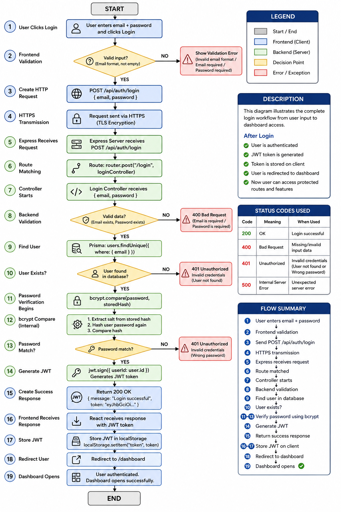
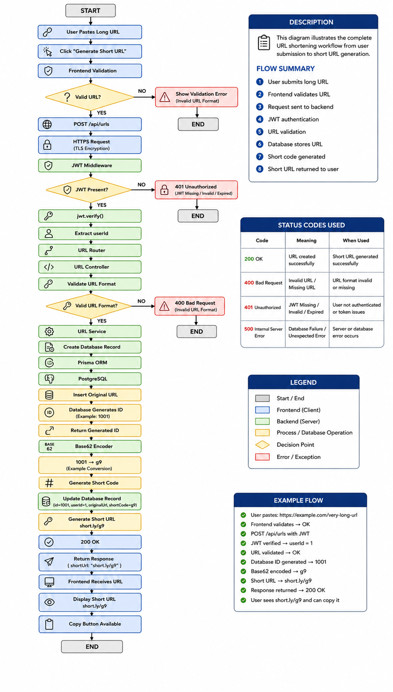
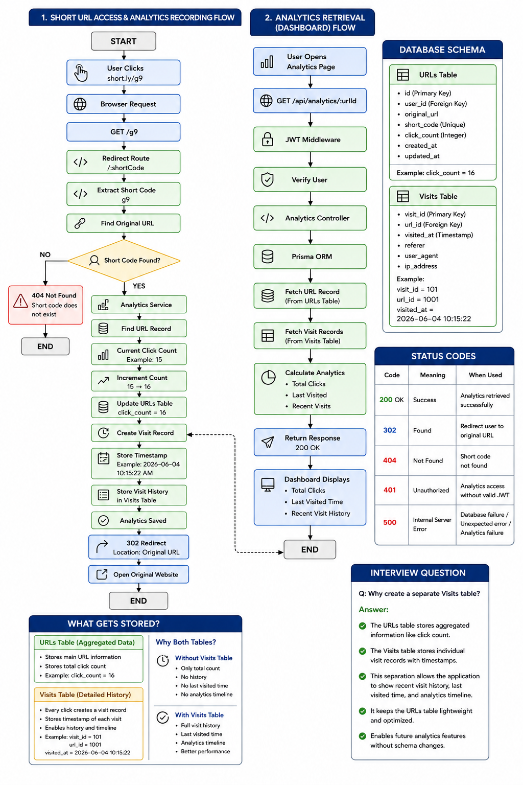
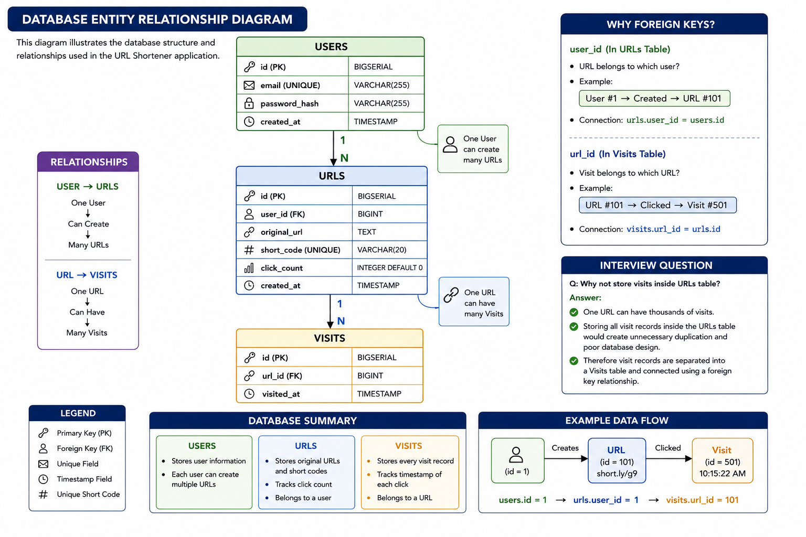

# Architecture Documentation

## Overview

This document describes the architecture, workflows, and system design of the URL Shortener application.

All architecture diagrams are stored inside the diagrams folder.

---

# 1. System Architecture

## Description

This diagram provides a high-level overview of the complete application architecture including frontend, backend, authentication, business logic, ORM layer, and database.

## Diagram

---

# 2. User Signup Flow

## Description

This diagram illustrates the complete signup workflow from user input to database storage.

The flow includes:

- User Input
- HTTPS Request
- Route Handling
- Controller Execution
- Validation
- bcrypt Salt Generation
- Password Hashing
- Database Storage
- Response Generation

## Diagram

---

# 3. User Login Flow

## Description

This diagram illustrates the complete login workflow.

The flow includes:

- User Login Request
- Route Handling
- User Lookup
- Password Verification
- JWT Generation
- Response Delivery
- Token Storage

## Diagram

---

# 4. URL Creation Flow

## Description

This diagram explains how a long URL is converted into a short URL.

## Diagram

---

# 5. URL Redirection Flow

## Description

This diagram explains how a short URL redirects users to the original URL.

## Diagram

---

# 6. Analytics Tracking Flow

## Description

This diagram explains how analytics information is recorded whenever a short URL is accessed.

## Diagram

---

# 7. Database Entity Relationship Diagram

## Description

This diagram illustrates the relationships between all database entities.

Entities:

- Users
- URLs
- Visits

Relationships:

- One User → Many URLs
- One URL → Many Visits

## Diagram

---
